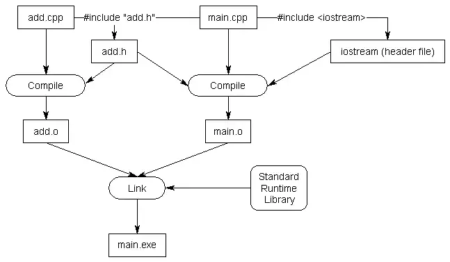

- [2 - 函数和文件](#2---函数和文件)
  - [2.1 - 函数简介](#21---函数简介)
  - [2.2 函数返回值](#22-函数返回值)
  - [2.3 - void 函数](#23---void-函数)
  - [2.4 - 函数形参和实参](#24---函数形参和实参)
  - [2.5 - 局部作用域](#25---局部作用域)
    - [局部变量](#局部变量)
  - [2.6 - 为什么函数有用，如何高效使用函数](#26---为什么函数有用如何高效使用函数)
  - [2.7 - 前向声明和定义](#27---前向声明和定义)
    - [前向声明](#前向声明)
  - [2.8 - 多文件程序](#28---多文件程序)
  - [2.9 - 命名冲突和命名空间](#29---命名冲突和命名空间)
    - [std 命名空间](#std-命名空间)
  - [2.10 - 预处理器简介](#210---预处理器简介)
    - [include](#include)
    - [宏定义](#宏定义)
      - [有替换文本的对象类型宏](#有替换文本的对象类型宏)
      - [替换文本的对象类型宏](#替换文本的对象类型宏)
      - [条件编译](#条件编译)
        - [`if 0`](#if-0)
      - [宏定义的作用域](#宏定义的作用域)
  - [头文件](#头文件)
    - [编写头文件](#编写头文件)
    - [源文件需要包含其对应的头文件](#源文件需要包含其对应的头文件)
  - [2.12 - 头文件防卫式声明](#212---头文件防卫式声明)

# 2 - 函数和文件

## 2.1 - 函数简介

```cpp
#include <iostream>

void foo() {
    std::cout << "Yuri!" << '\n';
}

int main() {
    foo();
    foo();
    foo();
    return 0;
}
```

> “foo” 是一个没有意义的单词。
> 在展示某些概念的时候，如果名称不重要，那么常会使用它来作为占位符。

## 2.2 函数返回值

```cpp
#include <iostream>
 
int getValueFromUser() {
    std::cout << "Enter an integer: ";
    int input{};
    std::cin >> input;
    return input;
}
 
int main() {
    int x{getValueFromUser()}; // first call to getValueFromUser
    int y{getValueFromUser()}; // second call to getValueFromUser
    std::cout << x << " + " << y << " = " << x + y << '\n';
    return 0;
}
```

## 2.3 - void 函数

## 2.4 - 函数形参和实参

> 函数的形参是能够在函数内部使用的变量，在函数声明时定义。
> 实参指的是函数被调用时，主调函数传递给被调函数的值。
> 在函数被调用的时，所有的形参都被当作变量创建，然后所有的实参都被拷贝到对应的形参。
> 这个过程称为按值传递。

```cpp
#include <iostream>
 
int add(int a, int b) {
    std::cout << "形参 a 的地址为: " << &a << '\n';
    std::cout << "形参 b 的地址为: " << &b << '\n';
    return a + b;
}

int main() {
    int a, b;
    std::cin >> a >> b;
    std::cout << "实参 a 的地址为: " << &a << '\n';
    std::cout << "实参 b 的地址为: " << &b << '\n';
    int c = add(a, b);
    std::cout << a << " + " << b << " = " << c << '\n';
    return 0;
}
```

## 2.5 - 局部作用域

### 局部变量

局部变量是在包含其定义的一组花括号的结尾时销毁的，其销毁的顺序和定义顺序正好相反

## 2.6 - 为什么函数有用，如何高效使用函数

## 2.7 - 前向声明和定义

### 前向声明

虽然我们可以在 main 之前定义函数，但是如果 A 调用 B，B 调用 A 就不行了。使用前向声明

```cpp
#include <iostream>

// 前向声明
bool isEven(int n);

bool isOdd(int n) {
    if (n == 0) return false;  // 0 不是奇数
    return isEven(n - 1);      // 交给 isEven 处理
}

bool isEven(int n) {
    if (n == 0) return true;   // 0 是偶数
    return isOdd(n - 1);       // 交给 isOdd 处理
}

int main() {
    int n;
    std::cin >> n;
    if (isEven(n)) std::cout << n << " 是偶数\n";
    else std::cout << n << " 是奇数\n";
    return 0;
}
```

## 2.8 - 多文件程序

`add.cpp`

```cpp
int add(int x, int y) {
    return x + y;
}
```

`main.cpp`

```cpp
#include <iostream>

int add(int x, int y);

int main() {
    int x{}, y{}; 
    std::cin >> x >> y;
    std::cout << x << " + " << y << " = " << add(x, y) << '\n';
    return 0;
}
```

## 2.9 - 命名冲突和命名空间

### std 命名空间

```cpp
#include <iostream>
 
int main() {
    std::cout << "Hello world!"; 
    return 0;
}
```

> `::` 符号实际上是一个运算符，称为空间解析运算符（scope resolution operator）
> 该运算符左侧是命名空间的名字，右侧则是该空间中包含的标识符
> 如果左侧未指定任何命名空间，则默认为全局命名空间

## 2.10 - 预处理器简介

预处理器（preprocessor） 是在“编译之前”执行的一道处理程序。它读取以 # 开头的命令，比如

```cpp
#include
#define
#ifdef
#endif
```

### include

```cpp
#include <iostream>
 
int main()
{
    std::cout << "Hello, world!";
    return 0;
}
```

> 当预处理器处理该程序时，它会把 `#include <iostream>` 这一行
> 替换为名为 `iostream` 的头文件的全部内容，
> 然后再对合并后的代码继续进行预处理和编译

### 宏定义

#### 有替换文本的对象类型宏

```cpp
#include <iostream>
 
#define MY_NAME "Alex"
 
int main()
{
    std::cout << "My name is: " << MY_NAME;
 
    return 0;
}
```

#### 替换文本的对象类型宏

比如，`#define USE_YEN`。任何遇到该标识符的地方，都会被替换为空白

#### 条件编译

条件编译预处理器指令使我们可以控制在何种条件下，对应的代码需要编译或者不需要编译。

`#ifdef` 指令会让预处理器检查某个标识符是否被 `#define` 过，如果是的话，`#ifdef` 和 `#endif` 之间的代码将会被编译，否则这些代码会被忽略

```cpp
#include <iostream>
#define YURI

int main() {
    #ifdef YURI
        std::cout << "雨夜明月" << '\n'; 
    #endif

    #ifndef HI
        std::cout << "Hello World" << '\n';
    #endif 
    
    return 0;
}
```

##### `if 0`

它可以它包裹范围内的代码排除在编译之外

```cpp
#include <iostream>
 
int main()
{
    std::cout << "Joe\n";
 
#if 0 // Don't compile anything starting here
    std::cout << "Bob\n";
    /* Some
     * multi-line
     * comment here
     */
    std::cout << "Steve\n";
#endif // until this point
 
    return 0;
}
```

#### 宏定义的作用域

`main.cpp`

```cpp
void doSomething(); 

#define PRINT
 
int main() {
    doSomething();
    return 0;
}
```

`function.cpp`

```cpp
#include <iostream>
 
void doSomething() {
#ifdef PRINT
    std::cout << "Printing!";
#endif
#ifndef PRINT
    std::cout << "Not printing!";
#endif
}
```

> 上面的代码最后会输出 `Not printing!`
> 尽管 `PRINT` 被定义在了 main.cpp 中，但是它丝毫不会影响 `function.cpp` 
> 对 `PRINT` 的定义只在 `main.cpp` 中有效

## 头文件

头文件中通常只包含声明，而不包含函数和变量的定义。

> 每个 `.cpp` 文件会单独编译
> 声明只是告诉编译器这个符号存在，可以重复出现
> 但定义会生成实际符号，多个 `.cpp` 包含同一个定义会在链接阶段引发 `multiple definition` 错误

### 编写头文件

`add.cpp`

```cpp
#include "add.h"    
 
int add(int x, int y) {
    return x + y;
}
```

`add.h`

```h
int add(int x, int y);
```

`main.cpp`

```cpp
#include "add.h" 
#include <iostream>
 
int main() {
    std::cout << "The sum of 3 and 4 is " << add(3, 4) << '\n';
    return 0;
}
```



### 源文件需要包含其对应的头文件

这么做可以使得有些问题可以在编译时被发现，而不是留到链接时再发现。比如声明时的返回值与具体实现时的返回值不一样

## 2.12 - 头文件防卫式声明

> 头文件防卫式声明可以避免头文件被多次包含到同一个文件中
> 但是不会避免它们被包含到多个文件中

`main.cpp`

```cpp
#include "square.h" // square.h is also included once here
#include <iostream>
 
int main() {
    std::cout << "a square has " << getSquareSides() << " sides\n";
    std::cout << "a square of length 5 has perimeter length " << getSquarePerimeter(5) << '\n';
    return 0;
}
```

`square.cpp`

```cpp
#include "square.h"
 
// actual definition for getSquareSides
int getSquareSides() {
    return 4;
}
 
int getSquarePerimeter(int sideLength) {
    return sideLength * getSquareSides();
}
```

`square.h`

```cpp
#ifndef SQUARE_H
#define SQUARE_H
 
int getSquareSides(); // forward declaration for getSquareSides
int getSquarePerimeter(int sideLength); // forward declaration for getSquarePerimeter
 
#endif
```