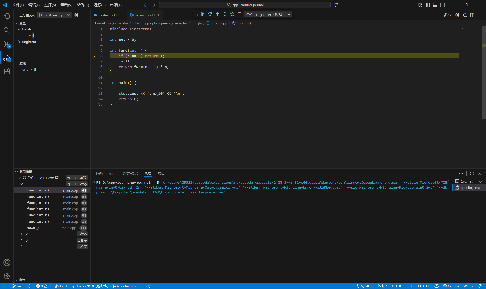

# 3 - 调试 C++ 程序

## 3.1 - 语法和语义错误

## 3.2 - 代码调试步骤

## 3.3 - 代码调试策略

## 3.4 — 基本代码调试技术

## 3.5 - 更多代码调试技术

## 3.6 - 使用集成调试器之单步调试

单步调式会进入函数内部，可以使用单步跳出快速结束

## 3.7 - 使用集成调试器之运行和断点

### 运行到光标处

在 vscode 中按下 `ctrl + shift + P`，输入  `Debug: Run to Cursor` 实现。
相较于直接打断点调试，这种调试可以直接跳处循环结构。

```cpp
#include <iostream>
#include <vector>
#include <string>

void heavyLoop(int n) {
    int sum = 0;

    std::cout << "[heavyLoop] Start\n";

    // 👇 这是要跳过的循环（故意写很大）
    for (int i = 0; i < n; i++) {
        sum += i;
    }

    std::cout << "[heavyLoop] End. sum = " << sum << "\n";  // ← 建议用 Run to Cursor 跳这里
}

void nestedLoops() {
    int counter = 0;

    std::cout << "[nestedLoops] Start\n";

    for (int i = 0; i < 5; i++) {
        std::cout << "  Outer i: " << i << "\n";

        for (int j = 0; j < 1000000; j++) { 
            counter++;
        }
    }

    std::cout << "[nestedLoops] Done. counter = " << counter << "\n"; // ← 也可以跳这里
}

int main() {
    std::cout << "[main] Start\n";

    heavyLoop(100000000);  // ← 在这里单步进入，然后跳循环
    nestedLoops();         // ← 或从这跳入循环后跳出来

    std::cout << "[main] Finished\n";
    return 0;
}
```

## 3.8 - 使用集成调试器之监控变量

## 3.9 - 使用集成调试器之调用栈

可以查看函数调用情况



## 3.10 - 在问题发生前发现问题

