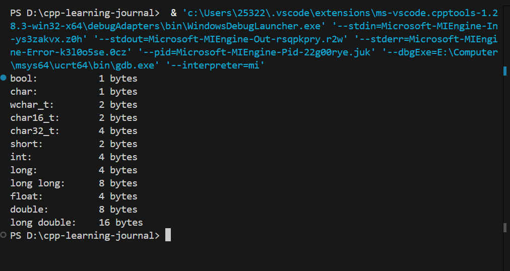
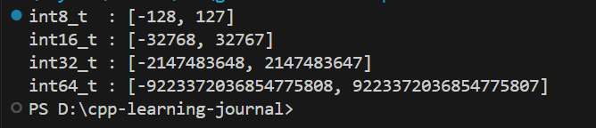
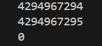
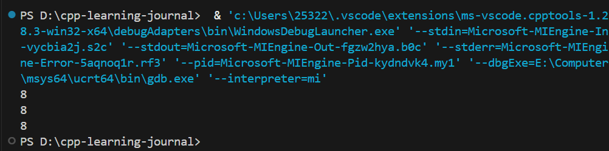
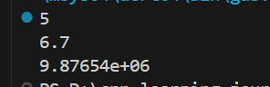
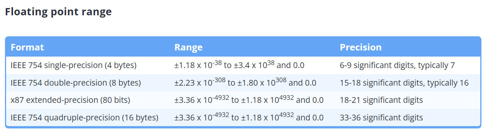
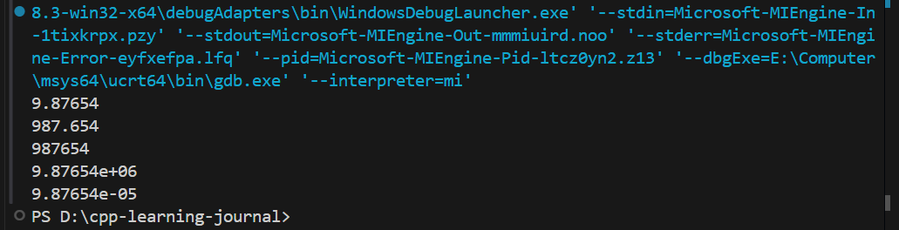
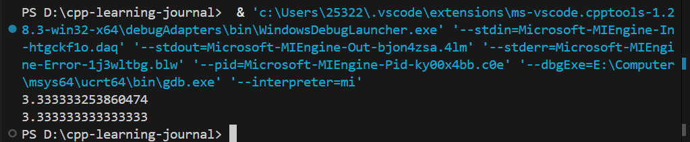
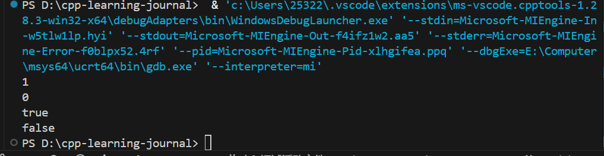
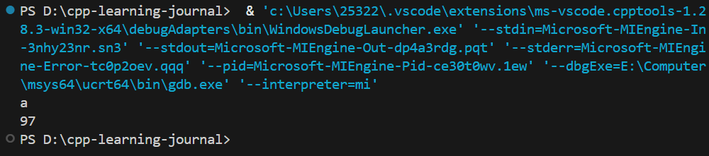

# 4 - 基本数据类型

## 4.1 - 基础数据类型简介

内存的最小可寻址单元（CPU 能直接访问的最小内存块大小）是字节（Byte），而字节由 8 个连续的比特（bit）组成。bit 是信息的最小单位

## 4.2 - Void

## 4.3 - 对象的大小和 sizeof 操作符

> - C++ 只保证了每种基础数据类型占用空间的最小值，具体大小和编译器及计算机体系结构相关
> - CPU 按照某个长度来处理数据，只有当数据类型的大小等于该长度时才会更快，并不一定占用内存小的数据结构更快

### sizeof 

可以使用数据类型或者变量名

```cpp
#include <iostream>
 
int main() {
    std::cout << "bool:\t\t" << sizeof(bool) << " bytes\n";
    std::cout << "char:\t\t" << sizeof(char) << " bytes\n";
    std::cout << "wchar_t:\t" << sizeof(wchar_t) << " bytes\n";
    std::cout << "char16_t:\t" << sizeof(char16_t) << " bytes\n";
    std::cout << "char32_t:\t" << sizeof(char32_t) << " bytes\n";
    std::cout << "short:\t\t" << sizeof(short) << " bytes\n";
    std::cout << "int:\t\t" << sizeof(int) << " bytes\n";
    std::cout << "long:\t\t" << sizeof(long) << " bytes\n";
    std::cout << "long long:\t" << sizeof(long long) << " bytes\n";
    std::cout << "float:\t\t" << sizeof(float) << " bytes\n";
    std::cout << "double:\t\t" << sizeof(double) << " bytes\n";
    std::cout << "long double:\t" << sizeof(long double) << " bytes\n";
 
    return 0;
}
```



## 4.4 - 有符号整型

有符号整型的溢出会导致未定义行为。C++ 中整数除法会舍弃小数部分。

```cpp
#include <iostream>
#include <cstdint>      // std::int8_t, std::int16_t, ...
#include <limits>       // std::numeric_limits

int main() {
    // typedef signed char int8_t
    // 在前面加上一个 + 可以把它提升为 int
    std::cout << "int8_t  : [" 
              << +std::numeric_limits<std::int8_t>::min() << ", "
              << +std::numeric_limits<std::int8_t>::max() << "]\n";

    std::cout << "int16_t : [" 
              << std::numeric_limits<std::int16_t>::min() << ", "
              << std::numeric_limits<std::int16_t>::max() << "]\n";

    std::cout << "int32_t : [" 
              << std::numeric_limits<std::int32_t>::min() << ", "
              << std::numeric_limits<std::int32_t>::max() << "]\n";

    std::cout << "int64_t : [" 
              << std::numeric_limits<std::int64_t>::min() << ", "
              << std::numeric_limits<std::int64_t>::max() << "]\n";

    return 0;
}
```



## 4.5 - 无符号整型以及为什么要避免使用它

`unsigned` 类型的所有算术运算都按模 `2ⁿ` 进行，所以不会出现溢出行为。

```cpp
#include <iostream>
#include <limits>

int main() {
    unsigned int uint_max = std::numeric_limits<unsigned int>::max();
    for (int i = -1; i <= 1; i++) {
        std::cout << uint_max + i << '\n';
    }
    return 0;
}
```



## 4.6 - 固定宽度整型和 size_t

### 固定宽度整型（std::int32_t）

保证位宽不变，跨平台行为完全一致

### 速度优先整型（std::int_fast32_t）

选择在当前平台上运算最快的整型

### 尺寸优先整型（std::int_least32_t）

保证至少达到某个位宽，但允许更大

### size_t

对于 `sizeof` 以及其他返回长度或大小的函数，返回值的类型为 `size_t`

```cpp
#include <iostream>
#include <vector>
#include <string>
#include <cstddef>  // size_t

int main() {

    std::vector<int> arr = {1, 2, 3};
    std::string str = "yuri";

    std::cout << sizeof(std::size_t) << '\n';
    std::cout << sizeof(arr.size()) << '\n';
    std::cout << sizeof(str.size()) << '\n';

    return 0;
}
```



## 4.7 - 科学计数法

### 如何将数字转换为科学计算法

```
起始值: 42030
小数点左移 4 位：4.2030e4
有效数字左侧没有需要删除的 0：4.2030e4
删除有效数字末尾的 0：4.203e4 (4 位有效数字)
```

```
起始值: 0.0078900
小数点右移 3 位: 0007.8900e-3
删除有效数字左侧的 0: 7.8900e-3
不需要删除有效数字末尾的 0: 7.8900e-3 (5 位有效数字)
```

```
起始值: 600.410
小数点左移 2 位: 6.00410e2
有效数字左侧没有需要删除的 0: 6.00410e2
不需要删除有效数字末尾的 0: 6.00410e2 (6 位有效数字)
```

有效数字部分的位数（e 前面的部分）称为有效数字。有效数字决定了这个数的精度

## 4.8 - 浮点数

### 打印浮点数

```cpp
#include <iostream>

int main() {    
    std::cout << 5.0 << '\n';
    std::cout << 6.7f << '\n'; // 浮点数字面量默认是 double
    std::cout << 9876543.21 << '\n';

    return 0;
}
```






### 浮点数的精度

在输出浮点数的时候，`std::cout` 的默认精度为 6，也就是保留 6 位有效数字

```cpp
#include <iostream>
 
int main() {
    std::cout << 9.87654321f << '\n';
    std::cout << 987.654321f << '\n';
    std::cout << 987654.321f << '\n';
    std::cout << 9876543.21f << '\n';
    std::cout << 0.0000987654321f << '\n';
 
    return 0;
}
```



可以使用 `std::setprecision()` 来指定 `std::cout` 的精度。它们被定义在 `iomanip` 头文件中

```cpp
#include <iostream>
#include <iomanip> // std::setprecision()
 
int main() {
    std::cout << std::setprecision(16);
    std::cout << 3.33333333333333333333333333333333333333f <<'\n'; 
    std::cout << 3.33333333333333333333333333333333333333 << '\n'; 
    return 0;
}
```



## 4.9 - 布尔值

### 打印布尔变量

```cpp
#include <iostream>
 
int main() {
    std::cout << true << '\n';
    std::cout << false << '\n';
 
    std::cout << std::boolalpha; // print bools as true or false
 
    std::cout << true << '\n';
    std::cout << false << '\n';
    return 0;
}
```



你可以使用 `std::noboolalpha` 来关闭此功能

## 4.10 - if 语句简介

## 4.11 - 字符

## 4.12 - 类型转换和 static_cast

### 显式类型转换

```cpp
#include <iostream>
 
int main() {

    char ch{97};
    std::cout << ch << '\n';
    std::cout << static_cast<int>(ch) << '\n';
    return 0;
}
```



