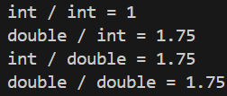
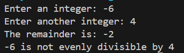
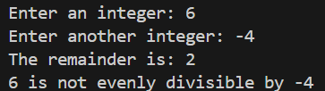
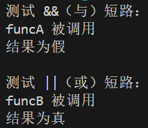

# 6 - 运算符

---

## 6.1 - 运算符优先级和结合律

---

## 6.2 - 数学运算符

---

### 使用 static_cast 对整型数进行浮点除法

从结果来看，只要有任何一个操作数是浮点数，就会执行浮点除法而不是整数除法

```cpp
#include <iostream>
 
int main() {
    int x{7};
    int y{4};
 
    std::cout << "int / int = " << x / y << '\n';
    std::cout << "double / int = " << static_cast<double>(x) / y << '\n';
    std::cout << "int / double = " << x / static_cast<double>(y) << '\n';
    std::cout << "double / double = " << static_cast<double>(x) / static_cast<double>(y) << '\n';
 
    return 0;
}
```



## 6.3 - 求模和指数运算

---

### 负数取模

负数也可以取模。`x % y` 的结果总是和 `x` 的符号一样

```cpp
#include <iostream>
 
int main() {
	std::cout << "Enter an integer: ";
	int x{};
	std::cin >> x;
 
	std::cout << "Enter another integer: ";
	int y{};
	std::cin >> y;
 
	std::cout << "The remainder is: " << x % y << '\n';
 
	if ((x % y) == 0)
		std::cout << x << " is evenly divisible by " << y << '\n';
	else
		std::cout << x << " is not evenly divisible by " << y << '\n';
 
	return 0;
}
```





## 6.4 - 自增自减运算符及其副作用

---

### 变量的自增自减

对于后缀递增，首先会创建一个 `x` 的临时拷贝，值和 `x` 的一样。随后这个拷贝被返回然后赋值给 `y`。最后这个临时拷贝就被丢弃了

```cpp
#include <iostream>
 
int main() {
    int x {5};
    int y = x++; 
 
    std::cout << x << ' ' << y;
    return 0;
}
```

## 6.5 - 逗号和条件运算符

### 逗号运算符

| 运算符 | 符号 | 形式 | 操作 |
|--------|------|------|------|
| 逗号运算符 | `,` | `x, y` | 先对 `x` 求值，再对 `y` 求值，然后返回 `y` 求值结果 |


```cpp
#include <iostream>
 
int main() {
    int x{1};
    int y{2};
    std::cout << (++x, ++y) << '\n';  // 3

    return 0;
}
```

---

### 条件运算符

| 运算符 | 符号 | 形式 | 操作 |
|--------|------|------|------|
| 条件运算符 | `?:` | `c ? x : y` | 如果 `c` 非零（真）则对 `x` 求值，否则对 `y` 求值 |

## 6.7 - 关系运算符和浮点数比较

---

## 6.8 - 逻辑运算符

### 短路求值

```cpp
#include <iostream>

bool funcA() {
    std::cout << "funcA 被调用\n";
    return false;
}

bool funcB() {
    std::cout << "funcB 被调用\n";
    return true;
}

int main() {
    std::cout << "测试 &&（与）短路：\n";
    if (funcA() && funcB()) { // funcA 为 false，所以 funcB 不会被调用
        std::cout << "结果为真\n";
    } else {
        std::cout << "结果为假\n";
    }

    std::cout << "\n测试 ||（或）短路：\n";
    if (funcB() || funcA()) { // funcB 为 true，所以 funcA 不会被调用
        std::cout << "结果为真\n";
    } else {
        std::cout << "结果为假\n";
    }

    return 0;
}
```

